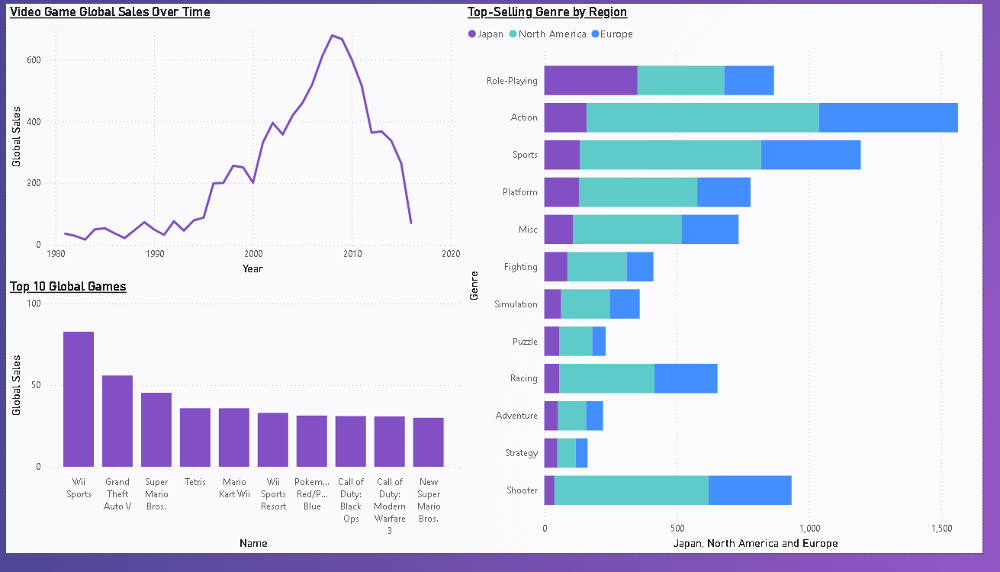
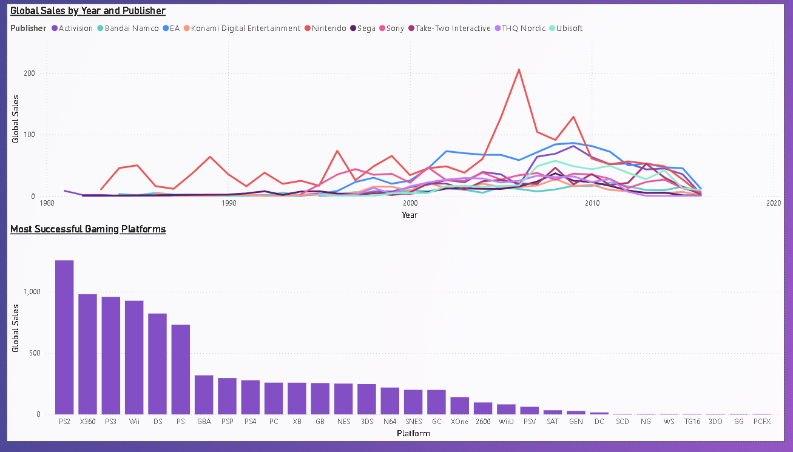

# Video Game Sales Analysis
A beginner-friendly data analysis project using Excel, Python (Pandas), SQL, and Power BI to explore and visualize video game sales data.

## 1. Project Objective + Business Question
**Objective**: To use historical game data to identify key trends in games sales, where they are being sold the most/least, what platforms sell the most games, etc.

**Business Questions**:
1. How has the video game industry changed over time?
2. Which gaming platforms were the most successful?
3. Which games and genres dominate in America, Europe, and Japan?
4. What publisher consistently produces top-selling games?

## 2. Methodology + Tools
1. **Data Cleaning**: Data cleaning was done using Jupyter Notebooks, where I looked for missing and repetitive values. All repeated publisher names were condensed into their main titles for easier analysis, and all null values were replaced with the string 'Unknown' using the fillna() function.
2. **Data Modeling**: Loaded the cleaned dataset into a SQL Server database for structured analysis.
3. **Analysis**: Used SQL to query the database and answer the business questions.
4. **Visualization + Reporting**: (Future Step) Will use Power BI to create an interactive dashboard for a final deliverable.

## 3. Key Findings + Visualizations
### Key Findings:
**Market Peak & Top Performer**: The video game industry's highest sales year was 2008, with a total of $678 million in global sales. The best-selling game of all time was Wii Sports.

**Regional Genre Dominance**: The Action genre was the top-selling genre in both North America and Europe. In contrast, the Role-Playing genre dominated the market in Japan.

**Most Successful Consoles**: The PlayStation 2 was the best-selling console globally, with the Xbox 360 and PlayStation 3 following closely behind.

**1. How has the video game industry changed over time?**
The game industry was selling at it's most in 2008, with $678 million being sold that year. The gaming industry then started to slowly climb back down, and by 2016 it was selling $70.93 million. 
**2. Which gaming platforms were the most successful?**
The PS2 was the most successful gaming platform with a total of $1,255.77 million global sales.
**3. Which games and genres dominate in America, Europe, and Japan?**
Globally, the dominant genre was Action. The top three best-selling games of all time were Wii Sports, Grand Theft Auto V, and Super Mario Bros.
**4. What publisher consistently produces top-selling games?**
Nintendo consistently produced top-selling games, significantly outperforming competitors in the mid-2000s, with a notable peak in sales in 2006.

### Visualizations:

